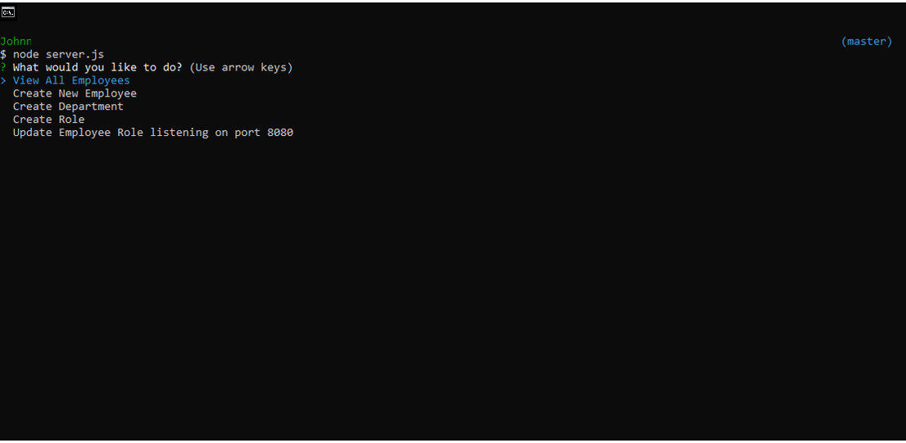

# Employee Tracker

## Table of Contents

* [Installation](#installation)
* [Summary](#summary)
* [Usage](#usage)
* [History](#history)
* [Credits](#credits)
* [License](#license)

# Installation

* Download my files in its entirety.
* Create new MySQL connection with the name of LocalHost (case sensitive), username of root and password of root.
* Use the employeetracker.sql file to create a new schema and tables on MySQL.
* Use see.sql to populate said tables.
* Using your terminal, navigate to the folder on your desktop.
* Use command "node server" in your terminal without the quotations.

# Summary

This program asks the user a series of questions then takes the answers and generates a table of employees. The user can add departments, roles, employees. View departments, roles, employees and update employee roles.

#### Application Demo:

# Usage

* This is strictly for educational purposes.

# History

https://github.com/johnnylieu/Employee_Tracker_HW/commits/master

# Credits

* gifmaker.org
* I want to thank my tutor Bobbi Tarkany for helping me with the finishing touches.

# License
 
* © 2019 Trilogy Education Services, a 2U, Inc. brand. All Rights Reserved.
* © UCSD Coding Bootcamp
